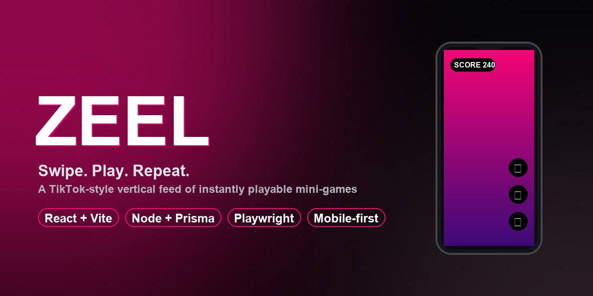

<p align="center">
  
</p>

<h1 align="center">ZEEL</h1>
<p align="center"><strong>Swipe. Play. Repeat.</strong></p>

<p align="center">
  A TikTok-style vertical feed for instantly playable mini-games — swipe to discover a new game,
  tap or use touch controls to play, like/comment/share, all in a fast mobile-first React + Node/Prisma app.
</p>

<p align="center">
  
  
  
  
  
  
  
  
  
  
</p>

---

ZEEL is a production-ready TikTok-style mini-game feed: React + Vite frontend, Express + Prisma backend, SQLite database, JWT HTTP-only cookies, local ZIP game uploads, threaded comments, likes, and sample games.

## Stack

- Backend: Node.js 20, Express, Prisma, SQLite, JWT cookies, Multer, Adm-Zip, Helmet, compression, rate limiting
- Frontend: React 18, Vite, Tailwind CSS, Framer Motion, Zustand, Axios, Chart.js, Playwright, Capacitor
- Brand: ZEEL, primary `#F50575`, secondary `#2D2D2D`

## Product Features

- Hot, Top, and New feeds with hotness scoring.
- Genre filters and genre following for a hybrid For You feed.
- Creator Studio with plays, likes, unique players, average play time, and a 7-day chart.
- Collections/bookmarks for saved games.
- XP, levels, login streaks, and badges.
- Global mute control with postMessage support for embedded games.
- Premium share sheet with copy, WhatsApp, Instagram copy, downloadable share card, and vector OG image route.
- System/dark/light theme preference.

## Project Structure

```
zeel-game-feed/
├── backend/            Express + Prisma API server
│   ├── src/            Controllers, routes, middleware
│   ├── prisma/         Schema, migrations, seed script
│   └── uploads/games/  Uploaded/playable HTML5 mini-games (zeel-real-01..53)
├── frontend/           React + Vite client
│   ├── src/            Components, pages, stores
│   └── tests/          Playwright end-to-end tests
├── assets/             Branding assets (banner, generator script)
└── docker-compose.yml  Local multi-service orchestration
```

## Local Development

Backend:

```bash
cd backend
npm install
npx prisma migrate dev --name init
npm run seed
npm run dev
```

If Prisma's schema engine is blocked on Windows, use the checked-in SQL migration:

```bash
npx prisma db execute --file prisma/migrations/202607250001_init/migration.sql --schema prisma/schema.prisma
npm run seed
```

Frontend:

```bash
cd frontend
npm install
npm run dev
```

Open `http://localhost:5173`. Test login is `test@test.com` / `password123`.

## QA

Run the browser click smoke test:

```bash
cd frontend
npx playwright test --project=chromium --reporter=line
```

## Production Build

Backend:

```bash
cd backend
npm run build
npm start
```

Frontend:

```bash
cd frontend
npm run build
npx vite preview --host 0.0.0.0 --port 3000
```

For server deployment, run the backend with PM2:

```bash
pm2 start backend/dist/src/index.js --name zeel-backend
```

Serve `frontend/dist` with Nginx, Caddy, or another static host.

## Mobile Build

```bash
cd frontend
npm run build
npx cap add android
npx cap add ios
npx cap sync
npx cap open android
```

## Upload Rules

- Upload accepts only ZIP archives.
- ZIP root must contain `index.html`.
- Maximum uploaded game size is 50MB.
- Extracted paths are sanitized to block path traversal.
- Game files are served from `/api/v1/games/serve/:uuid/*` with long-lived cache headers.

## Environment

Backend `.env`:

```env
PORT=5000
NODE_ENV=development
DATABASE_URL="file:./dev.db"
JWT_SECRET="SuperSecretNeonKey2026"
CORS_ORIGIN="http://localhost:5173"
MAX_FILE_SIZE_MB=50
```

Frontend `.env`:

```env
VITE_API_URL=http://localhost:5000/api/v1
```

## License

This project is licensed under the [MIT License](./LICENSE).
